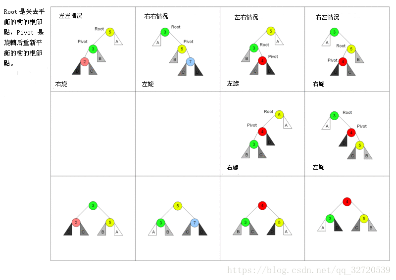

# algs

## **线性结构**

|数据结构|类|
|---|---|
|栈|[MyStack.java](./src/cx/Linear/MyStack.java)|
|队列|[MyQueue.java](./src/cx/Linear/MyQueue.java)|
|单链表|[Node.java](./src/cx/Linear/Node.java)|
|循环链表|[LoopNode.java](./src/cx/Linear/LoopNode.java)|
|双向链表|[DoubleNode.java](./src/cx/Linear/DoubleNode.java)|

## **常用排序**

|排序方法|类|
|---|---|
|冒泡排序|[BubbleSort.java](./src/cx/Sort/BubbleSort.java)|
|快速排序|[QuickSort.java](./src/cx/Sort/QuickSort.java)|
|插入排序|[InsertSort.java](./src/cx/Sort/InsertSort.java)|
|希尔排序|[ShellSort.java](./src/cx/Sort/ShellSort.java)|
|选择排序|[SelectSort.java](./src/cx/Sort/SelectSort.java)|
|归并排序|[MergeSort.java](./src/cx/Sort/MergeSort.java)|
|基数排序|[RadixSort.java](./src/cx/Sort/RadixSort.java)|
|堆排序|[HeapSort.java](./src/cx/Sort/HeapSort.java)|

## **树**

### 链式存储的二叉树

类[BinaryTree.java](./src/cx/Tree/BinaryTree.java)  
结点类[TreeNode.java](./src/cx/Tree/TreeNode.java)

|链式二叉树的操作|方法|
|---|---|
|前序遍历|frontShow()|
|中序遍历|midShow()|
|后序遍历|afterShow()|
|前序查找|frontSearch(i)|
|删除子树|delete(i)|

### 顺序存储的二叉树

只适用于完全二叉树  
类[ArrayBinaryTree.java](./src/cx/Tree/ArrayBinaryTree.java)  
应用：堆排序

|顺序存储二叉树的操作|方法|
|---|---|
|前序遍历|frontShow(i)|

### 线索二叉树

遍历高效  
类[ThreadedBinaryTree.java](./src/cx/Tree/Threaded/ThreadedBinaryTree.java)  
结点类[ThreadedNode.java](./src/cx/Tree/Threaded/ThreadedNode.java)  

|线索二叉树的操作|方法|
|---|---|
|中序线索化|threadNodes(node)|
|中序遍历|mi'dShow()|

### 霍夫曼树

带权路径最小，可用于压缩编码。  
类[HuffmanTree.java](./src/cx/Tree/Huffman/HuffmanTree.java)  

### 二叉排序树（BST）

有序的顺序存储查找方便，插入困难；  
无序的顺序存储查找困难，插入简单；  
链式存储插入和查找都困难；  
二叉排序树插入和查找性能都不会太差。  
类[BinarySortTree.java](./src/cx/Tree/BinSort/BinarySortTree.java)  
结点类[Node.java](./src/cx/Tree/BinSort/Node.java)  

|二叉排序树的操作|方法|
|---|---|
|插入结点|add(node)|
|查找结点|search(value)|
|删除结点|delete(value)|

### AVL树（平衡二叉树）

二叉排序树如果不平衡效率低下，AVL保证任何一个结点的左右子树高度差不超过1。  
操作：在BST树插入结点平衡破坏时对结点进行旋转

类[AVLTree.java](./src/cx/Tree/AVL/AVLTree.java)  
结点类[Node.java](./src/cx/Tree/AVL/Node.java)

|AVL树的操作|方法|
|---|---|
|结点的平衡因子|BF()|
|添加结点|add(node)|
|左旋转|leftRotate()|  
|右旋转|rightRotate()|

### 红黑树

具体见 算法第四版 的2-3树和左倾红黑树。  
自己编的小口决：左黑右红即左旋，红左连续即右旋，左右全红变全黑，根节点总为黑。

## 散列表（哈希表）

通过计算键值对中健的散列函数得到索引，通过索引值来进行查找和插入删除。  
散列表的关键在于处理碰撞冲突，因而可以分为两种实现：基于拉链法和基于开发地址的散列表。  

### 基于拉链法的散列表

类[NodeHashST.java](./src/cx/Hash/NodeHashST.java)  
链表符号表[NodeST](./src/cx/Hash/NodeST.java)

|操作|方法|
|---|---|
|计算键的散列函数|hash(key)|
|获取健的值|get(key)|
|插入新的键值对|put(key,value)|

### 基于开放地址的散列表（线性探测）

线性探测要求探测表的利用率要小于1/2，所以需要动态调整容量。  
类[LinearHashST.java](./src/cx/Hash/LinearHashST.java)  

|操作|方法|
|---|---|
|调整容量|resize(cap)|
|计算键的散列函数|hash(key)|
|插入新的键值对|put(key,value)|
|获取键的值|get(key)|
|删除|delete(key)|